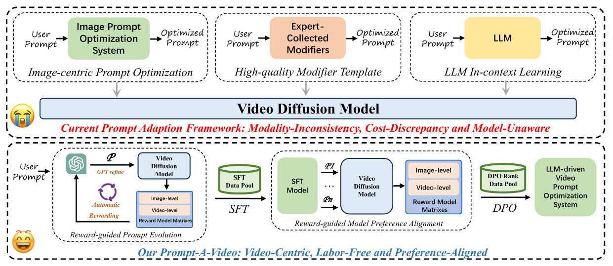

# Prompt-A-Video

The code base for [Prompt-A-Video: Prompt Your Video Diffusion Model via Preference-Aligned LLM](https://arxiv.org/pdf/2412.15156)

## Data and Weights

| Text-to-Video Model | Fine-tuning data | prompt booster |
| --- | --- | --- |
|Open-Sora 1.2 | | [HF Link](https://huggingface.co/jiyatai/Prompt_A_Video_OS) |
|CogVideoX | | [HF Link](https://huggingface.co/jiyatai/Prompt_A_Video_CV) |

Test benchmark

## Inference

## Fine-tuning

## DPO

## Acknowledge
* [LLama3](https://github.com/meta-llama/llama-cookbook)
* [CogVideoX](https://github.com/THUDM/CogVideo)
* [Open-Sora1.2](https://github.com/hpcaitech/Open-Sora)
* [VideoScore](https://github.com/TIGER-AI-Lab/VideoScore)
* [MPS](https://github.com/Kwai-Kolors/MPS)
* [Aesthetic Predictor](https://github.com/LAION-AI/aesthetic-predictor)